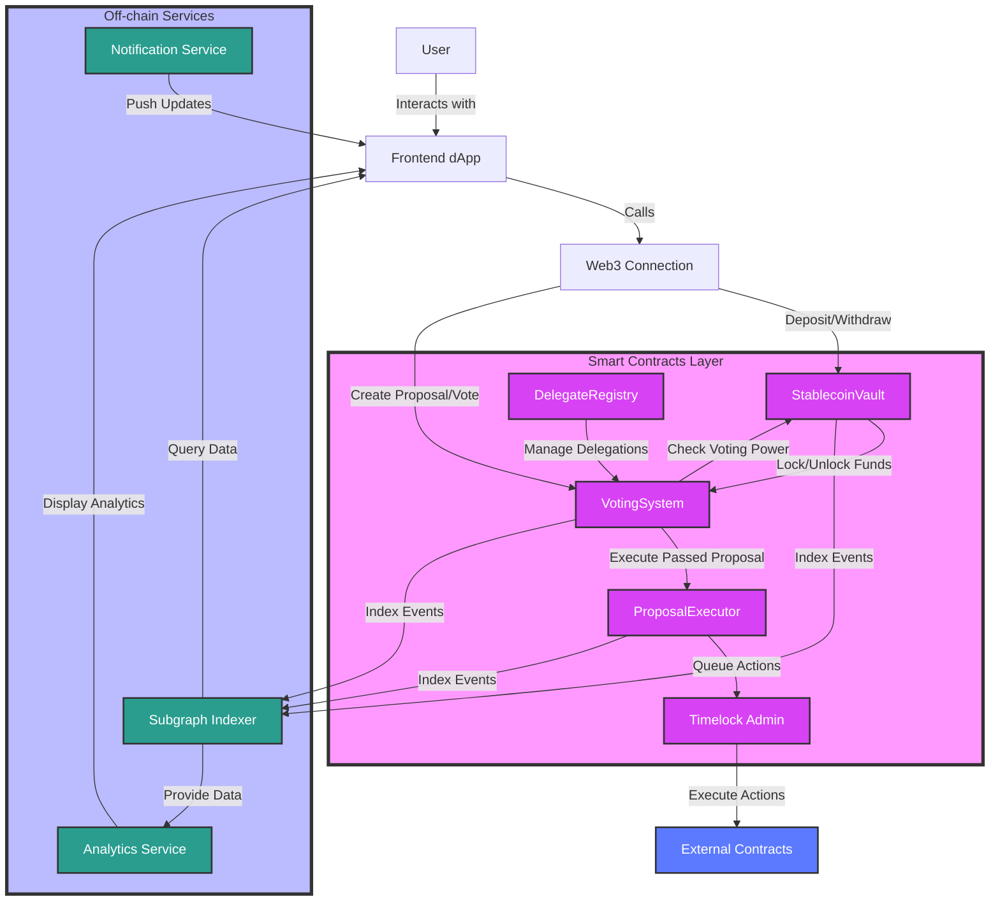

# Haikou: Stablecoin-Based Decentralized Voting System

## Overview
Haikou is a revolutionary decentralized voting system that leverages stablecoins (USDC and USDT) to create a more stable and equitable governance mechanism. By using stablecoins instead of volatile governance tokens, Haikou provides a more predictable and fair voting power distribution while encouraging long-term participation through time-weighted voting mechanisms.

## Architecture


## Project Structure
```
haikou/
├── contracts/           # Smart contract source files
├── frontend/           # React-based web application
├── subgraph/           # TheGraph indexing services
├── scripts/            # Deployment and maintenance scripts
├── test/              # Test suites
├── ignition/          # Deployment configurations
├── hardhat.config.ts  # Hardhat configuration
└── package.json       # Project dependencies
```

## Key Features
- **Stablecoin-Based Voting**: Uses USDC and USDT for stable voting power
- **Time-Weighted Voting**: Encourages long-term participation
- **Multiple Voting Mechanisms**: Supports various voting strategies
- **Delegation System**: Allows vote delegation to active participants
- **On-Chain Execution**: Automatic execution of passed proposals
- **Real-Time Analytics**: Comprehensive voting and participation metrics
- **Gas-Optimized**: Efficient implementation for cost-effective participation

## Getting Started

### Prerequisites
- Node.js v16+
- Yarn or npm
- MetaMask or similar Web3 wallet

### Installation
```bash
# Clone the repository
git clone https://github.com/yourusername/haikou.git

# Install dependencies
cd haikou
yarn install

# Install frontend dependencies
cd frontend
yarn install

# Start local development environment
yarn dev
```

### Smart Contract Deployment
```bash
# Deploy to local network
yarn hardhat deploy --network localhost

# Deploy to testnet
yarn hardhat deploy --network goerli
```

### Running Tests
```bash
# Run all tests
yarn test

# Run specific test file
yarn test test/StablecoinVault.test.ts
```

## Documentation

- [Smart Contracts Documentation](./contracts/README.md)
- [Frontend Documentation](./frontend/README.md)
- [Subgraph Documentation](./subgraph/README.md)
- [API Documentation](./docs/API.md)

## Security

### Audits
- Audit reports will be published in the `/audits` directory soon
- Security review scheduled soon

### Bug Bounty
Our bug bounty program details will be available at [bug-bounty-platform]

## Contributing
We welcome contributions! Please see our [Contributing Guidelines](CONTRIBUTING.md) for details.

## License
This project is licensed under the MIT License - see the [LICENSE](LICENSE) file for details.