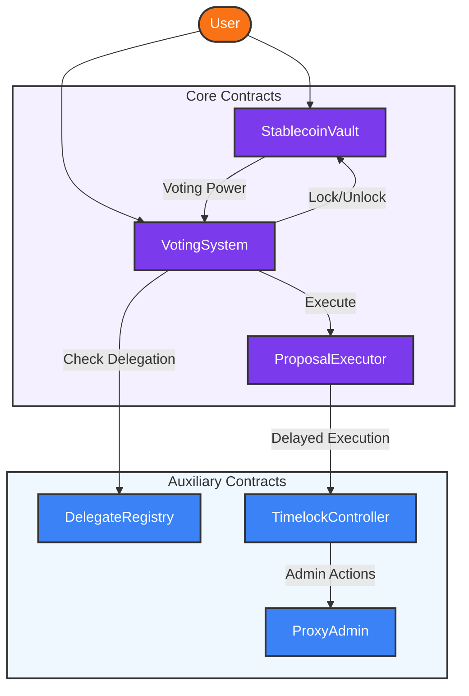

# Haikou Smart Contracts

## Contract Architecture

### Core Contracts

1. **StablecoinVault.sol**
   - Manages USDC and USDT deposits
   - Calculates time-weighted voting power
   - Handles lock/unlock mechanisms for voting
   - Features:
     - Time-weighted voting power calculation
     - Cooldown periods for withdrawals
     - Deposit limits and caps
     - Emergency pause functionality
     - Yield generation options (planned)

2. **VotingSystem.sol**
   - Manages the voting process
   - Supports multiple voting mechanisms
   - Features:
     - Simple majority voting
     - Quadratic voting
     - Ranked choice voting
     - Vote delegation
     - Proposal creation and management
     - Vote power snapshotting

3. **ProposalExecutor.sol**
   - Handles proposal execution
   - Manages execution timelock
   - Features:
     - Action batching
     - Execution delay
     - Transaction simulation
     - Emergency cancellation
     - Multi-signature requirements

4. **DelegateRegistry.sol**
   - Manages voting power delegation
   - Features:
     - Multiple delegation types
     - Delegation history tracking
     - Power calculation including delegations
     - Delegation limits and restrictions

### Auxiliary Contracts

1. **TimelockController.sol**
   - Controls execution delays
   - Manages admin actions
   - Features:
     - Configurable delay periods
     - Emergency actions
     - Admin role management

2. **ProxyAdmin.sol**
   - Manages upgradeable contracts
   - Features:
     - Upgrade coordination
     - Access control
     - Version management

## Contract Interactions



## Development

### Environment Setup
```bash
# Install dependencies
yarn install

# Compile contracts
yarn hardhat compile

# Run tests
yarn hardhat test
```

### Deployment
```bash
# Deploy to local network
yarn hardhat deploy --network localhost

# Deploy to testnet
yarn hardhat deploy --network goerli --tags production
```

### Contract Verification
```bash
# Verify on Etherscan
yarn hardhat verify --network mainnet DEPLOYED_CONTRACT_ADDRESS "Constructor arg 1" "Constructor arg 2"
```

## Testing

### Test Coverage
```bash
# Generate coverage report
yarn hardhat coverage
```

### Test Structure
```
test/
├── unit/              # Unit tests for individual contracts
├── integration/       # Integration tests for contract interactions
└── scenarios/        # Complex scenario tests
```

## Security

### Automated Checks
- Slither
- Mythril
- Echidna

### Manual Reviews
- Internal security review
- External audit (planned)

## Gas Optimization

### Implemented Optimizations
- Efficient storage patterns
- Batch processing
- Memory vs Storage optimization
- Event optimization

### Gas Snapshots
```bash
# Generate gas report
yarn hardhat test --gas-reporter
```

## Future Improvements

### Planned Features
- Multi-chain support
- Additional voting mechanisms
- Enhanced delegation features
- Yield generation integration
- Advanced analytics integration

### Upgrade Path
1. Deploy new implementation
2. Propose upgrade
3. Execute upgrade through timelock
4. Verify new implementation

## Documentation

### Contract Documentation
- Generated using NatSpec
- Available in `/docs/contracts`

### Architecture Decision Records
- Located in `/docs/adr`
- Details major design decisions

## License
All smart contracts are licensed under MIT